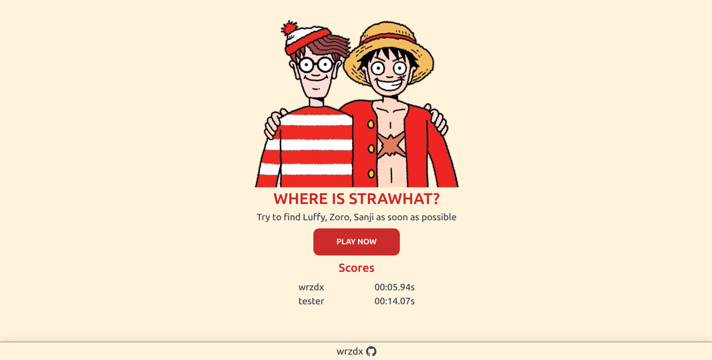

# Where is Strawhat? 🏴‍☠️

A full-stack “Where’s Waldo” style game featuring Monkey D. Luffy and the Straw Hat crew. Built with Express, Prisma, PostgreSQL, and React (Vite).

* **Live:** [https://wrzdx.github.io/Where-s-Waldo/](https://wrzdx.github.io/Where-s-Waldo/)

---

## Snapshots



---

## Key Features

* **Interactive Gameplay**: Find Monkey D. Luffy, Roronoa Zoro, and Sanji on a large map.
* **Click Detection**: Smart coordinate-based validation with radius tolerance.
* **Timer System**: Tracks completion time in real-time.
* **Dropdown Selection**: Choose which character you found after clicking the map.
* **Visual Feedback**: Markers appear on correctly found characters.

---

## Additional Features

* **Leaderboard**: Submit your score and compare with other players.
* **Backend Validation**: Prevents cheating by verifying positions server-side.
* **JWT Game Sessions**: Secure start/finish flow using tokens.
* **Deployed Backend**: Hosted with Docker + Nginx on a custom domain.

---

## Tech Stack

### Backend

* Express.js
* Prisma
* PostgreSQL
* JWT Authentication

---

### Frontend

* React
* Vite
* CSS Modules

---

## Architecture

```text
Client (GitHub Pages)
        ↓
Nginx (reverse proxy)
        ↓
/api → Express backend (Docker)
        ↓
PostgreSQL (Neon)
```


